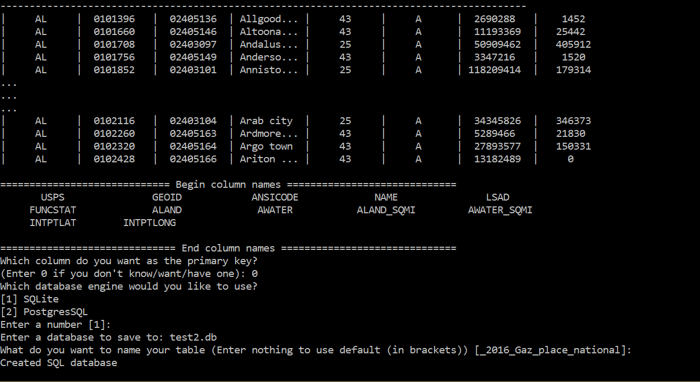

.. sqlify documentation master file, created by
   sphinx-quickstart on Sun Apr 30 21:27:00 2017.
   You can adapt this file completely to your liking, but it should at least
   contain the root `toctree` directive.

SQLify 1.0.0a1 Documentation
==================================

.. toctree::
   :maxdepth: 2
   :caption: Contents:

What is SQLify?
----------------
SQLify is a tool written in Python that allows for easy conversion of common data sources, like text files and comma-separated values (CSV) into SQL databases. Currently, SQLite and PostgresSQL and supported.

https://github.com/vincentlaucsb/sqlify

Easy to Use
------------
SQLify's features can be accessed via Python or a command line interface.

**Using the CLI**

After installing SQLify, from the command line/terminal, **cd** into the directory where your files are stored and type in

.. code-block:: none

   sqlify
   
(Yes it's that simple.)

For more information on using the Python module, see :doc:`python`. On the other hand, the command line interface is rather self-explanatory, but you can read more about it at :doc:`cli`.

Motivation
-----------
While SQLify is appropriate for anybody who wants to convert their data into SQL, it was developed in the context of statistical analysis and data science. By providing a tool which--with as little pain as possible--converts data into SQL format, analysts will be more able and willing to incorporate SQL into their toolset.

While SQL isn't a panacea, it does allow:

* Users to incorporate SQL queries into their data manipulation workflow (in addition to other tools like dplyr or pandas)

* Analysis of large-ish sized data sets (e.g. 100MB, 2GB, ..., and so on) on regular computers without having to resort to cloud computing

SQLify isn't the only tool in its domain. However, it is designed to be fast and user-friendly.

**Robust and Reliable**

Whether you look on CRAN or PyPI, there's tens of thousands of packages available. However, many could have been written by a team of a thousand monkeys pounding on typewriters. SQLify, however, is heavily tested to ensure the output data is the same as the input.

Performance and Limitations
----------------------------
Depending on your computer, SQLify will almost instantaneously convert files under 100 MB. Large files, e.g. those a few gigabytes (GB) in size, may take a few minutes.

* Generally speaking, the less transformations you perform (e.g. converting null values), the faster the process works
* SQLite conversion currently works faster than PostgresSQL conversion
* Memory is not an issue as files are lazy-loaded, i.e. instead of loading the entire file into memory, SQLify loads small chunks at a time
 
Documentation Contents
=======================

.. toctree::
   
   cli
   python

* :ref:`genindex`
* :ref:`modindex`
* :ref:`search`
